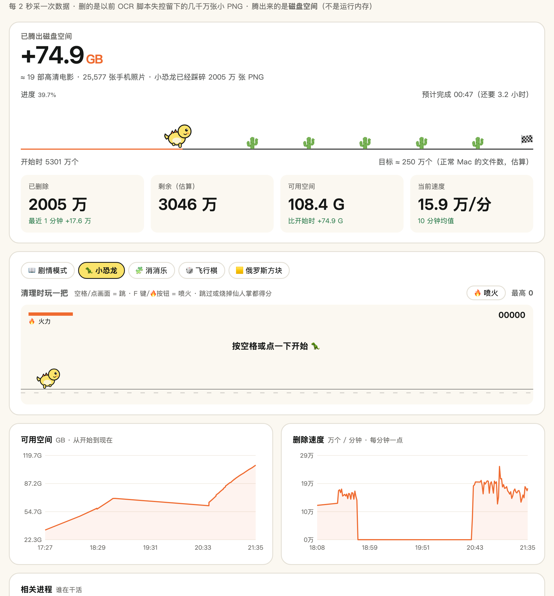

# 🦖 mac-disk-o · 边清理边玩的 Mac 磁盘清理 Skill

> 「我的 Mac 只剩 4.5G 了。」
> 「系统数据 281G。」
> 「凶手是 **5300 万张 PNG**。」
> 「比今年全国高考人数还多。」



这是一个 [Claude Code](https://claude.com/claude-code) Skill。它能帮你把 Mac 塞满的磁盘清干净，**清理过程中还能玩小恐龙喷火烧仙人掌**，仙人掌被烧会惨叫。

---

## 📖 起因

某天晚上，我的 Mac 弹窗说磁盘满了。

打开「储存空间」一看，**系统数据 281G**。用终端翻遍了所有文件夹，加起来只有 190G。剩下那 240G 去哪了？

找了一下午才找到：以前写的一个 OCR 小脚本失控了，在 `/tmp` 里一张一张地存截图，存了 **5300 万张**。电脑重启时，系统把它们挪进了「待清理区」，打算在后台慢慢删。

结果系统自己的清理进程一秒钟只删 14 张。照这个速度，大概要删到**明年春节**。

于是：

```
❌ rm -rf          → 电脑卡死，要先把 5300 万个文件名读进内存
❌ find -delete    → 同上
❌ 低优先级慢慢删   → 一分钟 900 个，要删 40 天
❌ 5 个命令一起删   → 电脑直接死机重启 💀
✅ 先暂停系统清理进程 + 流式删除 → 一分钟 9.5 万个，快了 100 倍
✅ 再开 3 个进程并行          → 一分钟 17.5 万个，起飞 🚀
```

要删好几个小时，干等太无聊，于是又做了一个**能玩的实时看板**。

---

## ✨ 它能干啥

### 1. 正经清理（安全第一）
- 按「纯缓存 → 已删 App 的残留 → 开发工具镜像 → 聊天 App → Downloads → 长期没用的 App」**由安全到危险**一层层扫。
- 出一张四档清单：🟢 可以放心删 / 🟡 你来拍板 / 🔵 只能在 App 里清 / 🔒 系统不让看。你确认一次就行，不会一条一条追着你问。
- **一律移进废纸篓，不直接删**，后悔了能放回原处。
- 发票、简历、合同、身份证这类文件名会被自动拎出来，不碰。

### 2. 「系统数据」几百 G 的悬案专项 🕵️
- 先用 `df -i` 数一下文件总数。正常 Mac 是两三百万个，你要是几千万个，就是我这个病。
- 一键删除脚本：暂停系统清理进程，3 个进程并行流式删除，全程防休眠，删完自动恢复系统清理进程。
- 中途断电、合盖都没关系，重新跑一遍会接着删。

### 3. 边清理边玩 🎮

打开看板：`python3 dashboard/server.py` → http://localhost:8765

| 看板上有什么 | 说明 |
|---|---|
| 🦖 进度小恐龙 | 跟着**真实清理进度**在跑道上跑，每 2 秒踩扁一棵仙人掌，头顶弹出金币，上面写着这 2 秒删了多少个文件 |
| 📈 实时曲线 | 可用空间一路往上涨、删除速度，鼠标悬停能看每个点的数值 |
| ⚙️ 进程表 | 谁在干活，谁在等磁盘，谁被我们按了暂停 |
| 📖 剧情模式 | 《我在 Mac 磁盘里当清洁工，系统让我删掉 5000 万只怪物》 |
| 🦖 小恐龙跑酷 | 空格跳，**F 喷火**，烧掉的仙人掌会惨叫，游戏速度跟着删除速度变 |
| 🧩 消消乐 / 🎲 飞行棋 / 🟨 俄罗斯方块 | 消掉的都是垃圾文件 |

### 📖 关于剧情模式

> 【叮！检测到宿主：一只普通的小恐龙。绑定"磁盘清理系统"成功。】
> 【主线任务：清除 /tmp 洞穴中的 5000 万只 PNG。】
> 【温馨提示：请严格遵守《磁盘求生守则》，违者后果自负。】

- 一共 5 章，**每一章都要等你电脑的真实清理进度到了才解锁**。想看结局？那就先把电脑清干净。
- 《磁盘求生守则》每章解锁一条，其中有一条是被篡改过的。
- 第 1 章角落里有个计数器在偷偷数幽灵。**千万别点它。**（守则第 1 条：看到长着同一张脸的 PNG 时，不要数它们有几只。）
- 结局有反转，还有两个选项，就不剧透了。

---

## 🚀 安装

```bash
git clone https://github.com/Minerva67/mac-disk-o.git ~/.claude/skills/mac-disk-cleanup
```

然后在 Claude Code 里说一句：

> 「我的 Mac 系统数据好大，帮我清理一下」

它会自己走完整套流程。

## ⚠️ 丑话说在前面

- 涉及**永久删除**的命令，Claude 只会把命令给你，**由你自己在终端执行**。它不会替你输密码，也不会背着你删东西。
- 删除脚本拒绝删根目录、用户目录这类顶层目录。但它终究是 `sudo` 删除，**执行前请看清目录名**。
- 同一个大目录，**同一时间只跑一套删除**。别问我怎么知道的 💀
- 只支持 macOS。

## 📊 实测数据（2026-10-06，MacBook Air）

| 做法 | 每分钟删除数 |
|---|---|
| 系统自己慢慢删 | ~800 |
| 低优先级删除 | ~900 |
| 流式删除 + 暂停系统清理进程 | ~95,000 |
| 3 个进程并行 | ~175,000 |
| 6 个进程并行 | ~190,000（再加进程也快不了多少，磁盘已经满负荷） |

可用空间：**4.5G → 正在往 200G+ 冲**（写这份 README 时已经腾出 70G，小恐龙还在跑）🎉

---

## 🙏 致谢

- 🌵 仙人掌图标来自 [Twemoji](https://github.com/jdecked/twemoji)（CC-BY 4.0）
- 握拳 logo 来自 Knock〃
- 那个写出失控脚本的我自己：没有你，就没有这个项目

*Made with 🦖 and [Claude Code](https://claude.com/claude-code)*
